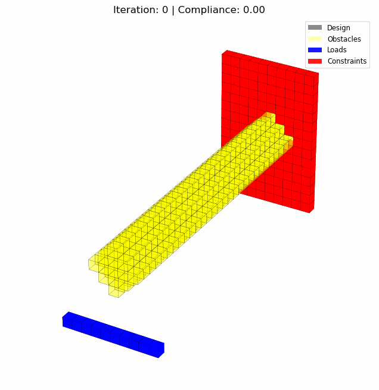

# PyTopo3D: 3D SIMP Topology Optimization Framework for Python




A comprehensive Python implementation of 3D Topology Optimization based on SIMP (Solid Isotropic Material with Penalization) method. Unlike traditional MATLAB implementations, PyTopo3D brings the power of 3D SIMP-based optimization to the Python ecosystem with support for obstacle regions.

## Overview

This code performs 3D structural topology optimization using the SIMP (Solid Isotropic Material with Penalization) method. It is designed to be efficient by utilizing:

- Parallel solver (PyPardiso if available, otherwise SciPy's spsolve)
- Precomputed assembly mapping for fast matrix assembly
- Minimal plotting overhead
- Support for obstacle regions where no material can be placed
- Flexible obstacle configuration via JSON files

## Installation

1. Clone this repository:
```bash
git clone https://github.com/jihoonkim888/PyTopo3D.git
cd PyTopo3D
```

2. Create and activate the conda environment:
```bash
# Create the environment from the environment.yml file
conda env create -f environment.yml

# Activate the environment
conda activate pytopo3d

# Alternatively, use the provided activation script
source ./activate_pytopo3d.sh
```

For better performance, it's recommended to have PyPardiso installed, which requires:
- A compatible BLAS/LAPACK implementation
- Intel MKL (included with PyPardiso)

## Usage

### Command-line Interface

To run a basic optimization:

```bash
python main.py --nelx 60 --nely 20 --nelz 10 --volfrac 0.3 --penal 3.0 --rmin 3.0
```

To include a default obstacle (cube in the middle):

```bash
python main.py --obstacle
```

To use a custom obstacle configuration from a JSON file:

```bash
python main.py --obstacle-config examples/obstacles_config.json
```

For full options:

```bash
python main.py --help
```

### As a Python Package

```python
import numpy as np
from pytopo3d.core.optimizer import top3d

# Define parameters
nelx, nely, nelz = 60, 20, 10
volfrac = 0.3
penal = 3.0
rmin = 3.0
disp_thres = 0.5

# Optional: Create an obstacle mask
obstacle_mask = np.zeros((nely, nelx, nelz), dtype=bool)
obstacle_mask[5:15, 20:40, 3:7] = True  # Example obstacle

# Run optimization
result = top3d(nelx, nely, nelz, volfrac, penal, rmin, disp_thres, obstacle_mask)

# Save result
np.save("optimized_design.npy", result)
```

### Using Obstacle Configuration Files

You can define complex obstacle configurations using JSON files:

```python
from pytopo3d.utils.obstacles import parse_obstacle_config_file

# Load obstacles from config file
shape = (nely, nelx, nelz)
obstacle_mask = parse_obstacle_config_file("path/to/config.json", shape)

# Use the mask in optimization
result = top3d(nelx, nely, nelz, volfrac, penal, rmin, disp_thres, obstacle_mask=obstacle_mask)
```

## Exporting Results as STL Files

You can export the final optimization result as an STL file for 3D printing or further analysis in CAD software.

### Command Line Arguments

```bash
python main.py --nelx 60 --nely 20 --nelz 10 \
               --volfrac 0.3 --penal 3.0 --rmin 3.0 \
               --export-stl \
               [--stl-level 0.5] \
               [--smooth-stl] \
               [--smooth-iterations 5]
```

- `--export-stl`: Flag to enable STL export of the final optimization result
- `--stl-level`: Contour level for the marching cubes algorithm (default: 0.5)
- `--smooth-stl`: Flag to apply Laplacian smoothing to the mesh (default: True)
- `--smooth-iterations`: Number of iterations for mesh smoothing (default: 5)

### How It Works

1. The optimized design is saved as a voxel representation (.npy file)
2. The voxel data is converted to a triangulated mesh using the marching cubes algorithm
3. Optional mesh smoothing is applied to improve the quality of the mesh
4. The mesh is exported as an STL file in the experiment results directory

This feature allows you to directly use the optimization results in CAD software or for 3D printing.

## Obstacle Configuration Format

The obstacle configuration file is a JSON file with the following structure:

```json
{
  "obstacles": [
    {
      "type": "cube",
      "center": [0.5, 0.5, 0.2],  // x, y, z as fractions [0-1]
      "size": 0.15                // single value for a cube
    },
    {
      "type": "sphere",
      "center": [0.25, 0.25, 0.6],
      "radius": 0.1
    },
    {
      "type": "cylinder",
      "center": [0.75, 0.5, 0.5],
      "radius": 0.08,
      "height": 0.7,
      "axis": 2                  // 0=x, 1=y, 2=z
    },
    {
      "type": "cube",
      "center": [0.25, 0.75, 0.5],
      "size": [0.15, 0.05, 0.3]  // [x, y, z] for a cuboid
    }
  ]
}
```

Supported obstacle types:
- `cube`: A cube or cuboid. Use `size` as a single value for a cube, or as `[x, y, z]` for a cuboid.
- `sphere`: A sphere. Use `radius` to set the size.
- `cylinder`: A cylinder. Use `radius`, `height`, and `axis` (0=x, 1=y, 2=z) to configure.

All positions are specified as fractions [0-1] of the domain size, making it easy to reuse configurations across different mesh resolutions.

## Design Space from STL Files

PyTopo3D allows using STL files to define the design space geometry, enabling complex shapes beyond the standard rectangular domain.

### Command Line Usage

To use an STL file to define your design space:

```bash
python main.py --design-space-stl path/to/design_space.stl --pitch 0.5
```

Command line options:
- `--design-space-stl`: Path to an STL file defining the design space geometry
- `--pitch`: Distance between voxel centers when voxelizing STL (default: 1.0, smaller values create finer detail)
- `--invert-design-space`: Flag to invert the design space (treat STL as void space rather than design space)

### How It Works

1. The STL file is loaded using the Trimesh library
2. The mesh is voxelized using the specified pitch value
3. The resolution of the resulting voxel grid is determined by the mesh geometry and pitch
4. The voxel grid becomes the design space mask (True values represent the design space)
5. A visualization of the design space is created and saved
6. The optimization is constrained to only operate within the design space

### Understanding Pitch and Resolution

The `pitch` parameter directly controls the resolution of the voxelized model:

- `pitch` represents the distance between voxel centers in the same units as your STL file
- Smaller pitch values create higher resolution voxelizations
- The number of voxels along any dimension = physical length ÷ pitch

For example:
- If your STL file has a length of 100mm on one side and you set `pitch=5`, you'll get 100mm ÷ 5mm = 20 voxels along that dimension
- Using `pitch=2` on the same model would result in 100mm ÷ 2mm = 50 voxels, creating a higher resolution representation
- Using `pitch=10` would result in only 10 voxels, creating a coarser representation

Choose your pitch value based on:
1. The level of detail needed for your optimization
2. The computational resources available (smaller pitch = more voxels = more computation)
3. The physical size of your STL model

### Python API Usage

You can also use this functionality directly in your Python code:

```python
from pytopo3d.utils.import_design_space import stl_to_design_space
import numpy as np

# Convert STL to design space mask
design_space_mask = stl_to_design_space(
    stl_file="path/to/design_space.stl",
    pitch=0.5,  # Smaller values create finer detail
    invert=False  # Set to True if STL represents void space
)

# The shape of the mask is determined by the STL geometry and pitch
nely, nelx, nelz = design_space_mask.shape
print(f"Resolution from voxelization: {nely}x{nelx}x{nelz}")

# Use the mask in optimization
# Areas outside the design space (False values) are treated as obstacles
from pytopo3d.core.optimizer import top3d

result = top3d(
    nelx=nelx, 
    nely=nely, 
    nelz=nelz, 
    volfrac=0.3, 
    penal=3.0, 
    rmin=3.0,
    disp_thres=0.5,
    obstacle_mask=~design_space_mask  # Areas outside design space become obstacles
)
```

Using STL files for design space definition allows you to:
- Import complex geometries from CAD software
- Perform topology optimization within arbitrary shapes
- Combine with obstacle configurations for advanced design constraints

## Configuration

The main optimization parameters are:

- `nelx`, `nely`, `nelz`: Number of elements in x, y, z directions
- `volfrac`: Volume fraction constraint (0.0-1.0)
- `penal`: Penalization power for SIMP method (typically 3.0)
- `rmin`: Filter radius for sensitivity filtering
- `disp_thres`: Display threshold for 3D visualization (elements with density > disp_thres are shown)
- `obstacle_mask`: Boolean 3D array marking regions where no material can be placed

## Acknowledgements

This code is adapted from [Liu & Tovar's MATLAB code](https://www.top3d.app/) for 3D topology optimization.

> K. Liu and A. Tovar, "An efficient 3D topology optimization code written in Matlab", Struct Multidisc Optim, 50(6): 1175-1196, 2014, doi:10.1007/s00158-014-1107-x
